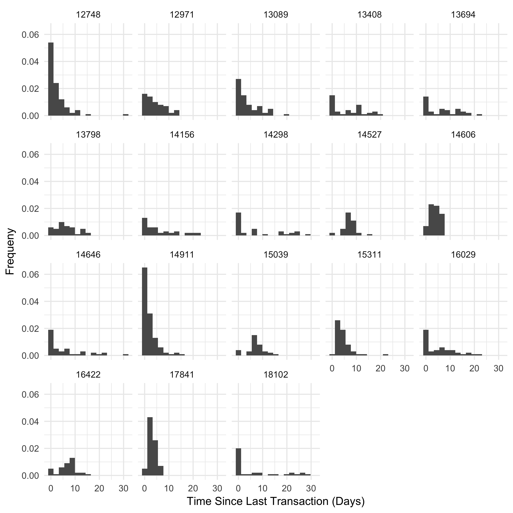
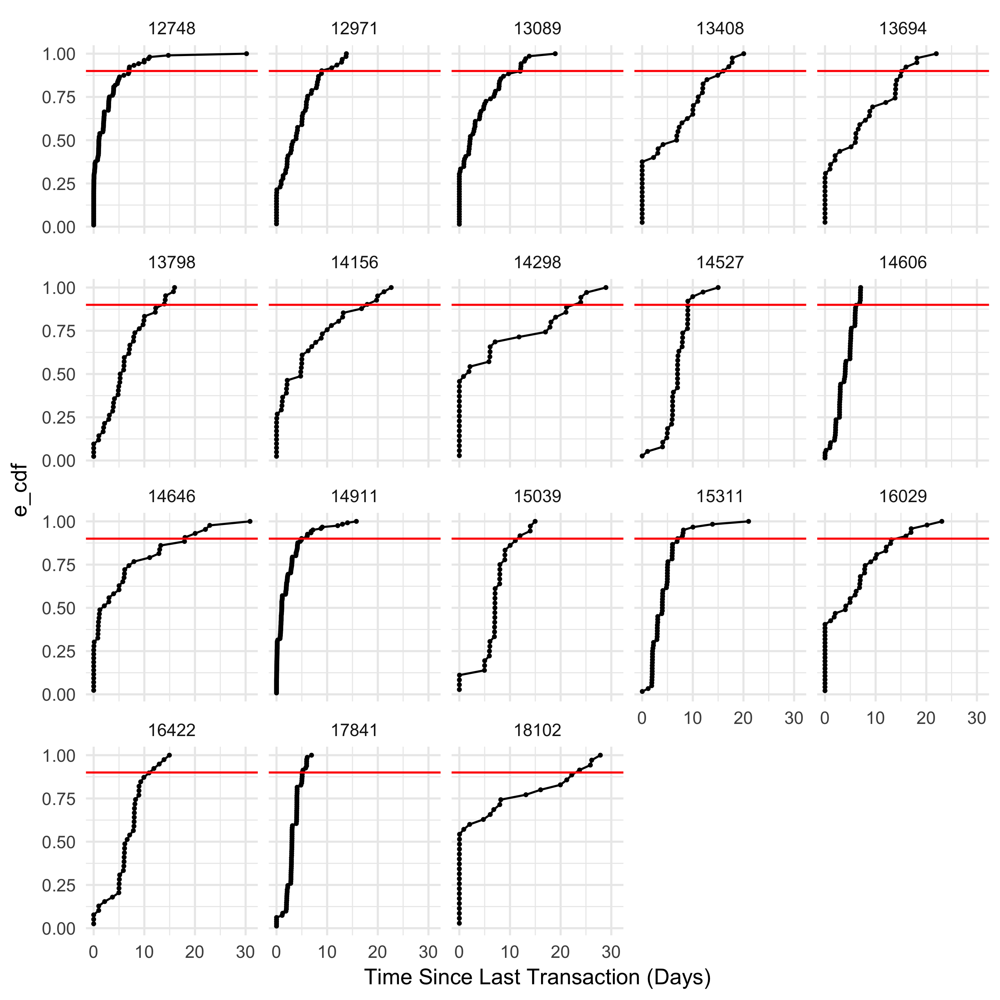

Author: Demetri Pananos

# Introduction

Retail churn is different than most other forms of churn.  Every transaction could be that customer's last, or one of a long sequence of transactions.  Normally, churn is a classification problem, but I don't think that classification is appropriate for retail.  For instance, a competitor may open closer to loyal customers, offering them the benefit of saving time.  Thus, these customers have churned without showing any signs.

When a customer churns, their between transaction times are large.  Perhaps so large that it may prompt retailers to think "Wow, I haven't seen customer X in a long time".  Can we mathematize this notion of not seeing a customer in a long time?  I think so.

I want to be able to make claims like "9 times out of 10, customer X will make another transaction within Y days of his previous transaction".  That way we can know when customers are displaying anomalous behavior.

To do this, we'll need to know the distribution of between transaction times for each customer.  That may be hard, especially if the distribution is bimodal or irregular.  In any case, we can accomplish what we want using the Empirical Cumulative Distribution Function.  Using the ECDF, we can approximate the the quantiles of each customer's between transaction time distribution, and obtain estimates of the nature I have mentioned above.

To do demonstrate my methodology, I'll use retail data obtained from the [UCI Machine Learning Respository](http://archive.ics.uci.edu/ml/datasets/online+retail).  

Let's get started.


# Data Munging

The first thing we'll have to do is slurp in the data.  Once we do that, we'll find that the rows of the data contain information about products, such as: how many were bought (`Quantity`), the price per unit (`Price`), who bought the product (`Customer ID`), when the product was bought (`InvoiceDate`), and which transaction the product was bought under (`InvoiceNo`).

What I really need to know is who bought a product and when.  To do this, I can group by the `Invoice No`, `Customer ID`, and `Invoice Date`.  This will tell me when a customer made a distinct purchase.  We'll have to filter out the returns from the data set.  A return is made when `Quantity<0`, so that is easy enough using `filter`.

From there, we can determine the time between transactions for each customer.


```r
library(tidyverse)
```

```
## Loading tidyverse: ggplot2
## Loading tidyverse: tibble
## Loading tidyverse: tidyr
## Loading tidyverse: readr
## Loading tidyverse: purrr
## Loading tidyverse: dplyr
```

```
## Conflicts with tidy packages ----------------------------------------------
```

```
## filter(): dplyr, stats
## lag():    dplyr, stats
```

```r
library(lubridate)
```

```
## 
## Attaching package: 'lubridate'
```

```
## The following object is masked from 'package:base':
## 
##     date
```

```r
theme_set(theme_minimal())

retail_data = read_csv('~/Documents/R/Online Retail.csv') #Read in the data
```

```
## Parsed with column specification:
## cols(
##   InvoiceNo = col_character(),
##   StockCode = col_character(),
##   Description = col_character(),
##   Quantity = col_integer(),
##   InvoiceDate = col_character(),
##   UnitPrice = col_double(),
##   CustomerID = col_integer(),
##   Country = col_character()
## )
```

```r
#Data lists purchases for single transactions amongst many rows.  Group them to see single txns

txns <- retail_data %>% 
  
        mutate(CustomerID = as.factor(CustomerID),
               InvoiceDate = ymd_hm(InvoiceDate)) %>% 
  
        group_by(CustomerID, InvoiceNo,InvoiceDate) %>% 
  
        summarise( Spend = sum(UnitPrice*Quantity)) %>% 
  
        ungroup() %>% 
  
        filter( Spend<=0,
                year(InvoiceDate)==2011,
                month(InvoiceDate)<10) 
        
#Find time between transactions now

time_between <- txns %>% 
  
                arrange(CustomerID,InvoiceDate) %>% 

                group_by(CustomerID) %>% 
    
                mutate(dt = as.numeric(InvoiceDate - lag(InvoiceDate), unit=  'days')) %>% 
          
                ungroup() %>% 
          
                na.omit()
Ntrans = txns %>% 
          group_by(CustomerID) %>% 
          summarise(N = n()) %>% 
          filter(N>10)
```
 
 
 Let's visualize the distributions for each customer.  Some distributions look as if they are exponential (which would be really nice because then we could model purchase incidence as a Poisson random variable).  Others are more irregular.  Modelling all these distributions as coming from one separately parameterized distribution would be very difficult.  Our non-parametric method is way easier, as we will see below.

```r
ggplot(data = time_between %>% inner_join(Ntrans), aes(dt)) + 
  
geom_histogram(aes(y = ..count../sum(..count..)), bins = 15) +

facet_wrap(~CustomerID) +
  
labs(x = 'Time Since Last Transaction (Days)',y = 'Frequeny')
```

```
## Joining, by = "CustomerID"
```



# Computation of the ECDF
 
I've written a little function to compute the ECDF for each customer.  Then, I can plot each ECDF and draw a line at 0.9.  The time where the ECDF crosses the line is the the approximate 90th percentile.  So if the ECDF crosses our line at 23 days, that means 9 times out of 10 that customer will make another transaction within 23 days.

Better yet, we can compute the approximate 90th percentile and display it in a dataframe.


```r
ecdf_df <- time_between %>% group_by(CustomerID) %>% arrange(dt) %>% mutate(e_cdf = 1:length(dt)/length(dt))

ggplot(data = ecdf_df %>% inner_join(Ntrans) , aes(dt,e_cdf) ) + 
  geom_point(size =0.5) +
  geom_line() + 
  geom_hline(yintercept = 0.9, color = 'red') + 
  facet_wrap(~CustomerID) +
  labs(x = 'Time Since Last Transaction (Days)')
```

```
## Joining, by = "CustomerID"
```




```r
getq <- function(x,a = 0.9){
  
  #Little function to get the alphath quantile
  if(a>1|a<0){
    print('Check your quantile')
  }
  
  X <- sort(x)
  
  e_cdf <- 1:length(X) / length(X)
  
  aprx = approx(e_cdf, X, xout = c(0.9)) #use linear interpolation to approx 90th percentile
  
  return(aprx$y)
}

quantiles = time_between %>% 
  
  inner_join(Ntrans) %>% 
  
  filter(N>5) %>% 
  
  group_by(CustomerID) %>% 
  
  summarise(percentile.90= getq(dt)) %>% 
  
  arrange(percentile.90)
```

```
## Joining, by = "CustomerID"
```

```r
head(quantiles,10)
```


# Discussion

Churn is very different for retailers, which means taking a different approach to modelling churn.  When a customer has churned, their time between transactions is anomalously large, so we should have an idea of what "anomalously" means for each customer.  Using the ECDF, we have estimated the 90th percentile of each customers between transaction time distribution in a non-parametric way. Now, we can examine the last time a customer has transacted, and if the time between then and now is near the 90th percentile (or any percentile you deem appropriate) then we can call them "at risk for churn" and take appropriate action to prevent them from churning.  Best of all, with more data our approach will become better and better since the ECDF converges in distribution to the CDF.

In this approach, I've not accounted for seasonality in transactions.  In implementation, the window in which we compute the ECDF would have to be appropriately short.  Parametric methods exist for modelling between transaction times, which would give better insight into the phenomena as a whole.  These methods are currently under investigation by the author.
